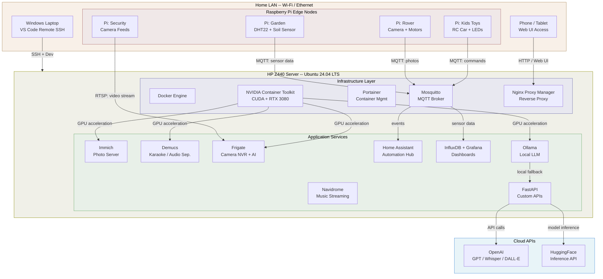
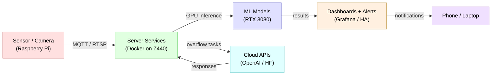
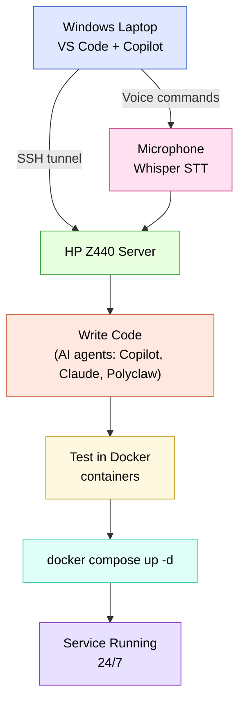

# Local Home Server

A personal home server project built around a refurbished HP Z440 workstation with an NVIDIA RTX 3080 GPU. This server runs 24/7 on Ubuntu and hosts a growing collection of self-hosted services and AI-powered applications, all developed through vibe coding with AI agents.

---

## Vision

Build a capable, quiet, always-on home server that acts as a **personal innovation lab**:

- **Replace cloud services** with self-hosted alternatives (photos, music, storage)
- **Run ML/AI workloads** locally using the GPU (classification, object detection, LLMs)
- **Integrate with edge devices** (Raspberry Pi nodes around the house for sensors, cameras, drones, toys)
- **Serve as a development sandbox** for rapid prototyping of family-oriented projects
- **Connect to cloud APIs** (OpenAI, HuggingFace Hub) when tasks exceed local GPU capacity
- **Grow over time** -- new project ideas get a folder, a Docker Compose file, and ship

Three layers working together:

1. **Server (HP Z440 + RTX 3080)** -- always-on Docker host, GPU compute, databases, APIs, ML training
2. **Edge devices (Raspberry Pis)** -- sensors, cameras, drones, kid toys, anything physical
3. **Cloud APIs (OpenAI, HuggingFace, etc.)** -- for models too large to run locally or quick experiments

---

## Hardware Summary

| Component | Target Spec | Budget |
|---|---|---|
| Base | HP Z440, Xeon E5-1630 v3+, 32 GB DDR4 ECC, 700 W PSU | ~$380-450 |
| GPU | Used NVIDIA RTX 3080 (10-12 GB VRAM) | ~$325-400 |
| Storage (OS) | 1 TB SATA SSD | ~$60 |
| Storage (Bulk) | 2 TB HDD (included with workstation) | included |
| Networking | PCIe Wi-Fi 6/6E + Bluetooth card | ~$25-35 |
| USB | Powered USB 3.0 hub (7-port) | ~$25-35 |
| Cooling | 1-2 quiet 120mm case fans (Noctua/Arctic) | ~$20-30 |
| Extras | Ethernet cables, surge protector, thermal paste | ~$20-30 |
| **Total** | | **~$900-1,000** |

Full hardware details and pre-purchase checklists: [HARDWARE.md](HARDWARE.md)
Prioritized $1,000 budget with Pi hardware included: [SHOPPING_LIST.md](SHOPPING_LIST.md)

---

## Planned Projects

| # | Project | Description | Status |
|---|---|---|---|
| 1 | [Photo Server](projects/photo_server/) | Local Google Photos alternative (upload, organize, face detection, search) | Not Started |
| 2 | [Music Server](projects/music_server/) | Music streaming + karaoke file generation from any track | Not Started |
| 3 | [Security Camera](projects/security_camera/) | Camera feed classifier using HuggingFace models (person/animal detection) | Not Started |
| 4 | [Garden Monitor](projects/garden_monitor/) | Raspberry Pi sensors + server dashboard for garden health | Not Started |
| 5 | [Home Assistant](projects/home_assistant/) | Central home automation hub integrating all edge devices | Not Started |
| 6 | [Pi Playground](projects/pi_playground/) | Raspberry Pi toys, games, and gadgets for the kids | Not Started |
| 7 | [Drone Monitor](projects/drone_monitor/) | Autonomous garden drone with camera + ML classification | Not Started |
| 8 | [API Projects](projects/api_projects/) | OpenAI / HuggingFace API-powered apps (chatbots, tools, automations) | Not Started |

---

## Architecture Overview



### Data Flow Summary



### Development Workflow



---

## Technology Stack

| Layer | Technology |
|---|---|
| OS | Ubuntu 24.04 LTS Server |
| Containerization | Docker + Docker Compose |
| GPU Runtime | NVIDIA Container Toolkit (CUDA) |
| Reverse Proxy | Nginx Proxy Manager or Caddy |
| Monitoring | Portainer + Grafana + InfluxDB |
| Edge Devices | Raspberry Pi (4/5) with Raspberry Pi OS |
| ML Frameworks | PyTorch, HuggingFace Transformers, ONNX Runtime |
| Cloud APIs | OpenAI (GPT, Whisper, DALL-E), HuggingFace Inference API |
| Communication | MQTT (Mosquitto) for Pi-to-server messaging |

---

## Repository Structure

```
Local_Server/
+-- README.md                 # This file
+-- OVERVIEW.md               # How it all works (start here if new)
+-- DEV_WORKFLOW.md           # How to develop with VS Code + AI agents
+-- SHOPPING_LIST.md          # Prioritized $1,000 budget (server + Pi)
+-- HARDWARE.md               # Detailed specs, eBay search tips
+-- SERVER_SETUP.md           # Ubuntu install, Docker, CUDA setup
+-- projects/
|   +-- README.md             # All projects overview
|   +-- photo_server/         # Immich / local Google Photos
|   +-- music_server/         # Navidrome + karaoke pipeline
|   +-- security_camera/      # Frigate + HuggingFace classifiers
|   +-- garden_monitor/       # Pi sensors + InfluxDB + Grafana
|   +-- home_assistant/       # Home automation hub
|   +-- pi_playground/        # Raspberry Pi toys and games for kids
|   +-- drone_monitor/        # Autonomous garden drone with camera
|   +-- api_projects/         # OpenAI / HuggingFace API-powered apps
+-- docker/
|   +-- README.md             # Docker Compose strategy and templates
+-- network/
|   +-- README.md             # Network topology, Pi integration
+-- research/
    +-- hardware_research.md  # Original Perplexity research notes
    +-- perplexity_raw.md     # Full Perplexity conversation (unedited)
```

---

## Getting Started

1. **Read the overview** -- [OVERVIEW.md](OVERVIEW.md) explains how everything fits together
2. **Buy the hardware** -- follow the prioritized budget in [SHOPPING_LIST.md](SHOPPING_LIST.md)
3. **Set up the server** -- follow [SERVER_SETUP.md](SERVER_SETUP.md) for Ubuntu + Docker + CUDA
4. **Set up your dev workflow** -- follow [DEV_WORKFLOW.md](DEV_WORKFLOW.md) for VS Code Remote SSH + AI agents
5. **Pick a project** -- start with the one that excites you most from [projects/](projects/)
6. **Vibe code it** -- use AI agents (GitHub Copilot, Claude, Polyclaw) to build fast

---

## Status

- [ ] Hardware purchased
- [ ] Ubuntu installed
- [ ] Docker + NVIDIA Container Toolkit configured
- [ ] First project deployed
- [ ] Raspberry Pi(s) connected
